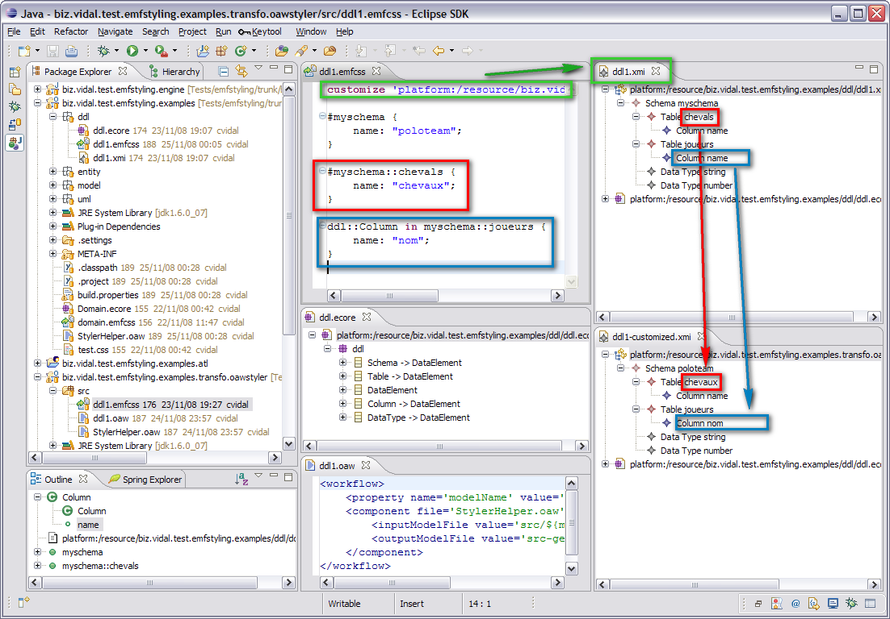
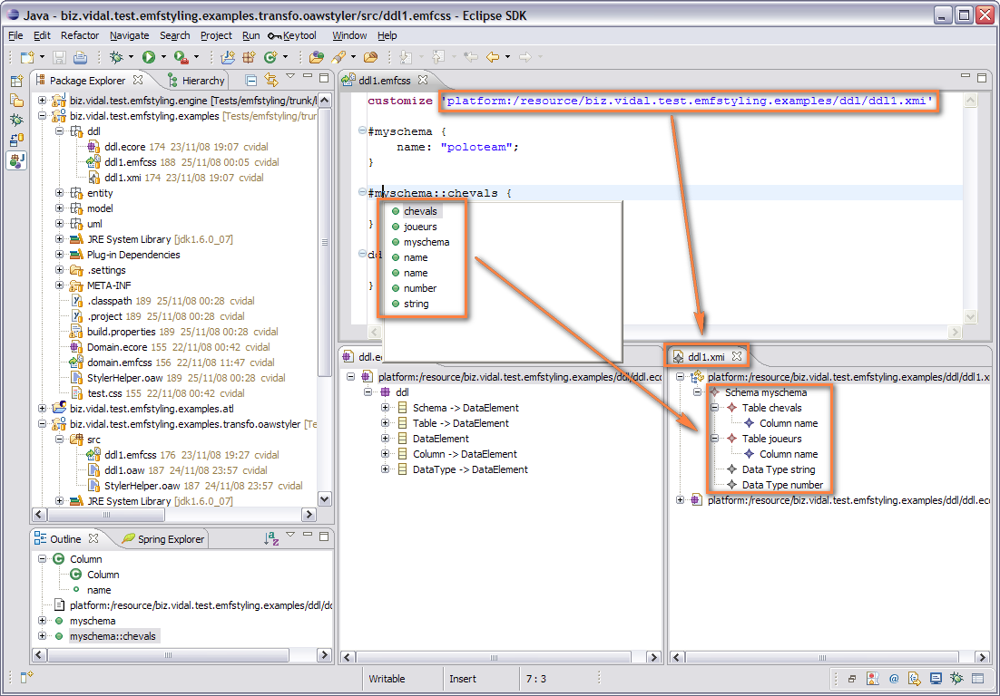
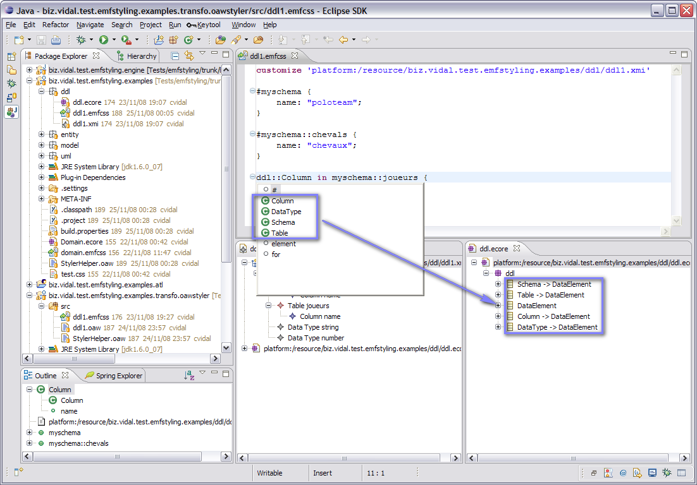

# EMF Customizer

EMF Customizer is a model (Ecore based) customization/styling/refining CSS like textual [DSL](http://en.wikipedia.org/wiki/Domain-specific_language) (Domain Specific Language) targeting [MDSD](http://en.wikipedia.org/wiki/Model_Driven_Software_Development) tool chains end users.

## News
- **16 October 2009** - EMF-Customizer won 4th place of the [Itemis Xtext Model Prize Laureate](http://xtext.itemis.com/xtext/language=en/25279/model-prize-laureate) :)

## Motivation
The motivation is to address the problem of customizing intermediate models in a Eclipse [EMF](http://en.wikipedia.org/wiki/Eclipse_Modeling_Framework) based MDSD [M2M](http://en.wikipedia.org/wiki/M2M_%28Eclipse%29) (Model to Model transformation) toolchain such as [Acceleo](http://acceleo.org/) or [openArchitectureWare](http://www.openarchitectureware.org/) in order to be able to do incremental model to model transformations while preserving user model refinements.

Currently, solutions exist to customize generated text with user code in model to text (M2T) transformations using either protected code regions or inheritance. This is a solved problem. But, as of today, there doesn't seem to be any such equivalent for customizing transformed models in model to model (M2M) transformations which is both freely available, simple to use and aimed at MDSD end users.

We strongly believe in the advantages of M2M over M2T based MDSD architectures, but being able to customize models in M2M chains is as critical as being able to customize generated code in M2T chains.

For these reasons, we decided to develop our own answer to this problem.

## Example
This is a [DDL](http://en.wikipedia.org/wiki/Data_Description_Language) customization scenario. Imagine the `ddl/ddl1.xmi` is an intermediate model in a MDSD toochain (maybe a [PSM](http://en.wikipedia.org/wiki/Platform-specific_model) in [MDA](http://en.wikipedia.org/wiki/Model-driven_architecture) terminology). It is generated from whatever [PIM](http://en.wikipedia.org/wiki/Platform-independent_model) and is supposed to be itself transformed into concrete SQL DDL scripts. Let's suppose you want to customize that intermediate ddl model.

### Overview

### Model code completion

### MetaModel code completion

## Status
EMF Customizer is no more a proof of concept but is not yet fully feature complete and should be considered alpha quality software because anything might change anytime (DSL and API). Some design decisions have not yet been finalized.

Internally, we're currently deploying it on a few projects in order to get feedback.

We're releasing it to the public early in order to get more feedback from a wider community so as to adjust the design as early as possible.

## What it's not
The goal is not to create yet another full blown transformation language, it targets end user developers who are not familiar at all with metamodeling and model to model transformation languages. It therefore looks like CSS, and keeps its semantics: cascading, id selectors, type selectors, ... .

## Quick start
Install EMF Customizer
Try the Simple DDL Customization use case

## About
**EMF Customizer** is an original idea published by [Cédric Vidal](https://vidal.biz), JEE & MDSD Architect at [ProxiAD Group](http://www.proxiad.com/), as a proof of concept named [EMF Styling on OPS4j](http://wiki.ops4j.org/display/ops4j/EMF+Styling) and has since been industrialized by ProxiAD Group. It is now used internally in our MDSD toolchain.

Over at ProxiAD Group, we're heavily using the ecosystem of Eclipse technologies spanning Modeling, Code generation, quality, IDE and runtime technologies so we decided to give back this little contribution to the community hoping it would be useful to others.